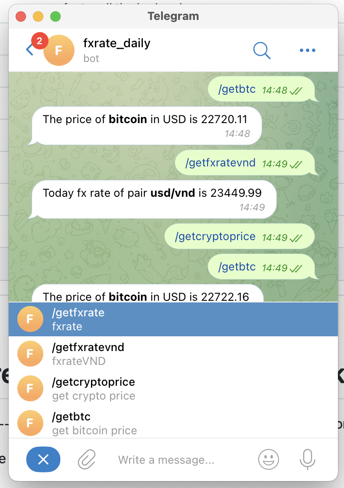

# A chatbot entirely built on Cloudflare Worker

List of required secrets for the cloudflare worker project
```
[
  {
    "name": "CHATID",
    "type": "secret_text"
  },
  {
    "name": "DOMINIC_CLIENT_ID",
    "type": "secret_text"
  },
  {
    "name": "DOMINIC_CLIENT_SECRET",
    "type": "secret_text"
  },
  {
    "name": "dominicDomain",
    "type": "secret_text"
  },
  {
    "name": "TELEGRAM_KEY",
    "type": "secret_text"
  }
]
```

Data flow 
telegram webhook --> cloudflare worker -> services api -> cloudflare worker -> telegram enpoint

Will build more endpoint in the future, using typescript
The features are 
```markdown
- getfxrate - fxrate
  + Usage: /getfxrate usd vnd (this example will convert usd into vnd)

- getfxratevnd - fxrateVND
  + Usage: get usd->vnd pair

- getcryptoprice - get crypto price
  + Usage: /getcryptoprice ethereum -> get ethereum to usd 

- getbtc - get bitcoin price
  + Usage: get bitcoin price
```
Just like below images

