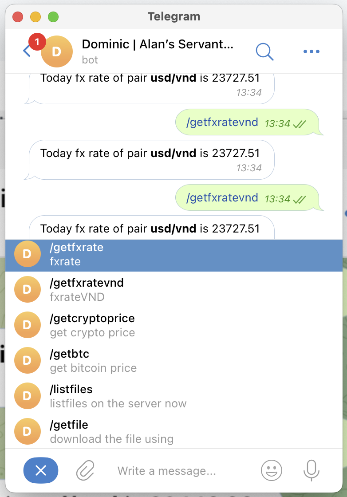

# A chatbot entirely built on Cloudflare Worker


Data flow 
telegram webhook --> cloudflare worker -> services api -> cloudflare worker -> telegram enpoint

Will build more endpoint in the future, using typescript
The features are 
```markdown
- getfxrate - fxrate
  + Usage: /getfxrate usd vnd (this example will convert usd into vnd)

- getfxratevnd - fxrateVND
  + Usage: get usd->vnd pair

- getcryptoprice - get crypto price
  + Usage: /getcryptoprice ethereum -> get ethereum to usd 

- getbtc - get bitcoin price
  + Usage: get bitcoin price

- listfiles - get all available folders 
  + Usage: to get the folder structure to choose folder to download

- getfile - download any file with a link
  + Usage: /getfile link_to_file folder_to_save_to (will save to root without specifying)

- downstats - get status of downloading files
  + Usage: /downstats -> get status of files being downloaded, is it finished or not etc

- pauseall - to pause all the being downloaded files at once
  + Usage: /pauseall
```
Just like below images



# Installation and setup
To make cloudflare worker to be working normally, here is the required secret files you need to input into the cloudflare secret

List of required secrets for the cloudflare worker project
```
[
  {
    "name": "CHATID",
    "type": "secret_text"
  },
  {
    "name": "DOMINIC_CLIENT_ID",
    "type": "secret_text"
  },
  {
    "name": "DOMINIC_CLIENT_SECRET",
    "type": "secret_text"
  },
  {
    "name": "dominicDomain",
    "type": "secret_text"
  },
  {
    "name": "TELEGRAM_KEY",
    "type": "secret_text"
  }
]
```
CHATID -> Your chat session you wish the bot to respond to
DOMINIC_CLIENT_ID -> Dominic is being served through Cloudflare Tunnel, you need to authen, need CLIENT_ID and SECRET
DOMINIC_CLIENT_SECRET -> Dominic is being served through Cloudflare Tunnel, you need to authen, need CLIENT_ID and SECRET
dominicDomain -> Domain of dominic, for example https://iam.dominic.com
TELEGRAM_KEY -> Key of your bot, you can get from your botfather UI on telegram